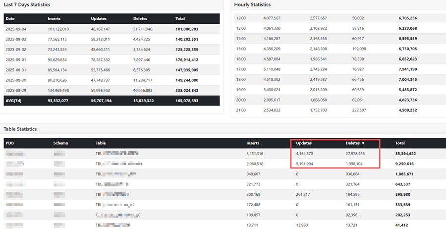

# GoldenGate Statistics Monitor

This application monitors Classic Oracle GoldenGate statistics and provides a web interface to view the data.



## Features

- **Stats Collection**: Automatically collects GoldenGate daily statistics from GGSCI
- **Schema-based Processing**: Efficiently processes tables by schema to reduce GGSCI calls
- **Web Dashboard**: Modern web interface to view statistics
- **Multiple Time Granularities**: 5-minute, hourly, and daily statistics
- **Daily Stats from GGSCI**: Uses GGSCI's daily statistics instead of cumulative totals
- **Hourly Interpolation**: Calculates hourly stats from daily snapshots
- **Fresh Start Support**: `-fresh` flag to reset all statistics when extract restarts

## Components

### Main Application (`ogg_stats_app.go`)
The main application that:
- Parses GoldenGate parameter files
- Collects statistics from GGSCI
- Stores data in SQLite database
- Runs scheduled stats collection
- Provides REST API endpoints
- Serves a modern web dashboard


## Usage

```bash
# Basic usage
./oggstats /u01/ogg/dirprm/extest.prm

# With custom interval (5 minutes)
./oggstats /u01/ogg/dirprm/extest.prm 5

# With custom interval and web port
./oggstats /u01/ogg/dirprm/extest.prm 5 8080

# Fresh start (truncate all stats when extract restarts)
./oggstats /u01/ogg/dirprm/extest.prm 5 8080 -fresh

# Run Webonly mode
./oggstats -webonly 8080
```

## Web Dashboard Features

1. **Schema Statistics**: Shows total tables vs changed tables per schema
2. **Daily Statistics**: Daily aggregated statistics
3. **Hourly Statistics**: Hourly breakdown for selected date
4. **Table Statistics**: Individual table performance for selected date

## Database Schema

The application creates the following tables:

- `ogg_tables`: Configured tables from parameter files
- `ogg_table_stats_snap`: Raw statistics snapshots (for historical tracking)

## API Endpoints

- `GET /api/schema-stats`: Schema-level statistics
- `GET /api/daily-stats?date=YYYY-MM-DD`: Daily statistics
- `GET /api/hourly-stats?date=YYYY-MM-DD`: Hourly statistics
- `GET /api/table-stats?date=YYYY-MM-DD`: Table-level statistics
- `GET /api/extracts`: List extracts

## Building

### Main Application
```bash
go mod tidy
go build -o oggstats.exe
```


## Requirements

- Go 1.21+
- SQLite3
- Oracle GoldenGate installation (for main application)
- C compiler (for SQLite3 driver)

## Notes

- The web server can run independently of the main application
- Copy `ogg_stats.db` from production to your local environment to view statistics
- The web interface auto-refreshes every 2 minutes
- Daily statistics come directly from daily snapshots
- Hourly statistics are calculated by interpolating between daily snapshots
- 5-minute statistics show incremental changes between runs

## Fresh Start Mode

When the GoldenGate extract is restarted, all statistics are reset to zero. Use the `-fresh` flag to truncate all stats tables if needed:

```bash
./oggstats /u01/ogg/dirprm/extest.prm 5 8080 -fresh
```

This will:
- Delete all data from `ogg_table_stats_snap`

The `ogg_tables` table (which contains the table configuration) is preserved.


